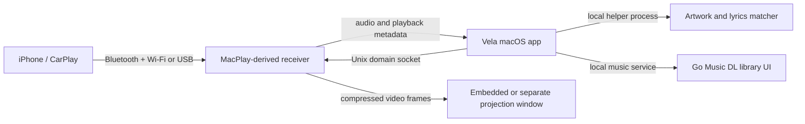

# 架构概览

Vela 把 Mac 音乐播放界面和 iPhone CarPlay 接收服务放进同一应用包中。接收服务由 Vela 启动和管理；MacPlay 提供 CarPlay 协议、无线连接和音视频运行时。

## 进程与本地通道

- Vela 原生应用负责窗口、队列、媒体控制、歌词和封面展示。
- `VelaCarPlayService.app` 是随 Vela 启动的无窗口接收服务。它由 MacPlay 源码和 MacPlay 运行时资源构建；独立运行 MacPlay 时会与 Vela 接收端争用同一连接，因此应先退出另一接收端。
- MacPlay 的元数据订阅使用 `/tmp/cp-bt.sock`。Vela 控制和视频帧使用按当前用户 UID 命名的 Unix domain socket。控制端校验对端 UID，视频端限制帧和消息大小。
- 元数据助手通过标准输入和输出接收一条 JSON 请求并返回一条 JSON 响应。它不需要把播放状态发到 Vela 的远端服务。
- Go Music DL 在本机提供音乐库页面和播放服务。它作为单独组件构建，代码和许可由其上游项目维护。

## 投屏窗口

MacPlay 视频引擎把协商的编码信息和压缩视频帧送到 Vela。原生渲染器把同一视频源显示在主界面或独立窗口中；窗口切换不应关闭 CarPlay 会话。投屏窗口的全屏和分辨率配置由接收端负责。

## 隐私边界

仓库只保存源码、公开图标、构建脚本和许可文本。运行时设置、认证材料和设备配对信息留在本机应用支持目录；构建脚本会拒绝从 MacPlay 运行时复制 `identity.pk8`、`certificate.p7b`、`settings.json` 或 `authentication` 路径。
